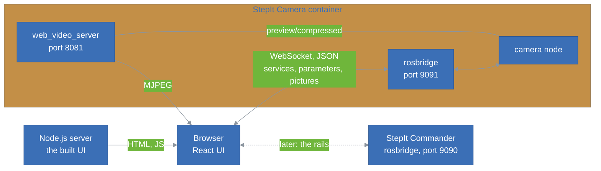
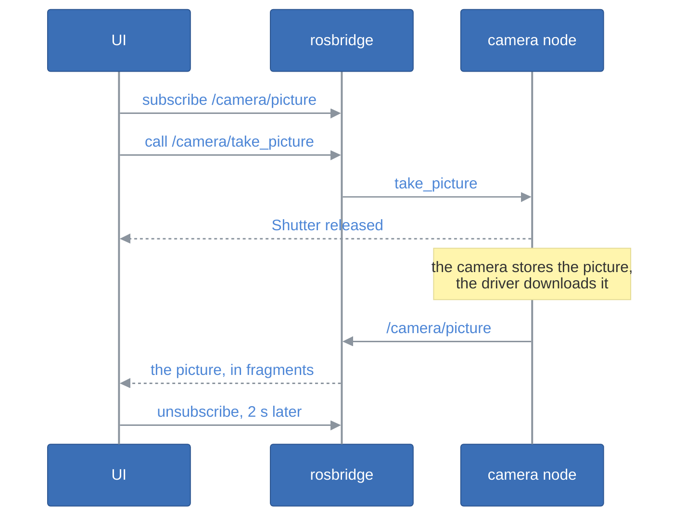

# StepIt UI Architecture

## Table of Contents <!-- omit in toc -->

- [Introduction](#introduction)
- [The Big Picture](#the-big-picture)
- [The Layers](#the-layers)
- [Talking to the Robot](#talking-to-the-robot)
  - [The rosbridge Client](#the-rosbridge-client)
  - [One rosbridge per Module](#one-rosbridge-per-module)
- [The Camera Section](#the-camera-section)
  - [The Live View](#the-live-view)
  - [The Settings](#the-settings)
  - [The Test Shot](#the-test-shot)
- [Tests](#tests)
- [How to Add a Section](#how-to-add-a-section)
- [Design Decisions and Trade-offs](#design-decisions-and-trade-offs)

## Introduction

This document explains how the StepIt UI is built, and where to start when we want to change something. It assumes we have read the [README](../README.md) and used the UI once.

## The Big Picture

The UI is a single-page React application, served as static files by a small Node.js server. It has no API of its own: the browser talks to the robot directly.

## The Layers

The client is in `src/client`, in three layers, each depending only on those below it:

| Layer | Files | Knows about |
|---|---|---|
| Transport | `ros/rosbridge.ts`, `ros/connection.ts` | rosbridge's protocol. Nothing about the robot. |
| Modules | `camera/camera.ts`, `camera/format.ts`, `camera/raw.ts` | The ROS interface of one module, e.g. the camera's services. No React. |
| State and views | `camera/store.ts`, `components/`, `App.tsx` | What the user sees and does. |

`settings.ts` keeps the preferences of the browser in `localStorage`: the theme, and where the servers of each module are. The state lives in [zustand](https://github.com/pmndrs/zustand) stores, as in the StepIt Editor.

## Talking to the Robot

### The rosbridge Client

`Rosbridge` in [`rosbridge.ts`](../src/client/ros/rosbridge.ts) is a small client of the rosbridge protocol, written for the UI rather than taken from `roslibjs`, like the StepIt Editor's:

- `callService()` sends `call_service` and resolves with the `service_response`. It fails at once when not connected, rather than waiting, so that a button can say it did not work; and it fails after a timeout, or when the connection drops.
- `subscribe()` sends one `subscribe` per topic, whatever the number of listeners, and `unsubscribe` with the last one. The subscriptions survive a reconnection.
- The connection comes back on its own, every 2 seconds, e.g. while the robot restarts.
- A message larger than rosbridge's fragment size, 10 MB, e.g. a RAW picture, comes as `fragment` messages, which the client puts back together.
- A `uint8[]` field comes as base64 text: `decodeBytes()` turns it back into bytes.

### One rosbridge per Module

A rosbridge can only handle the messages installed next to it. StepIt Commander's rosbridge, on port 9090, does not know `stepit_camera_msgs`, so the camera serves its own, on port 9091. Each section therefore names its rosbridge, and [`connection.ts`](../src/client/ros/connection.ts) keeps one connection per URL, shared by whoever uses it, with its status. The status at the top of the page is the one of the open section's rosbridge.

## The Camera Section

`Camera` in [`camera.ts`](../src/client/camera/camera.ts) is the camera driver's interface, one method per service. [`store.ts`](../src/client/camera/store.ts) holds the section's state, and `followCamera()` keeps it up to date while the section is open.

### The Live View

The live view is a plain `` whose source is web_video_server's MJPEG stream, with `type=ros_compressed`: the camera's JPEG frames go to the browser as they are, never decoded. The topic is written unescaped in the URL, since web_video_server does not decode `%2F`.

The driver only sends frames while streaming is on. During a test shot, no frame comes: the mirror goes down for the shot, and the driver is busy downloading the picture. The `` keeps the last frame, which the UI greys out from the click until the picture has come. The UI only knows about its own test shots: a shot fired by the external device pauses the live view too, without greying it out. The UI calls `start_streaming` when it connects, if the live view was on when the page was last used, and the Start and Stop buttons call `start_streaming` and `stop_streaming`.

### The Settings

`get_settings` returns each setting with its value and the values the camera accepts right now. The UI reads them when it connects, after each change, and every 3 seconds, to follow the mode dial and changes made on the camera itself. A change is a `set_parameters` call, as `ros2 param set` does; when the camera refuses it, the reason, which lists the accepted values, is shown under the setting.

[`format.ts`](../src/client/camera/format.ts) orders and labels the settings, and writes their values as the camera does, e.g. `f/5.6` and `1/125 s`. A setting it does not know is still shown, by its name: a setting added to the driver needs no change here.

### The Test Shot

The UI subscribes to `/camera/picture` only while it waits for its shot: a picture is the whole file, and a RAW file is about 29 MB, so it must not flow to the browser for every shot of the external device. It subscribes before releasing the shutter, so that the picture cannot come first, and keeps listening 2 seconds after the first file, for the second file of a RAW+JPEG shot.

A browser cannot show a RAW file, but a Canon CR2 carries a full-size JPEG preview: [`raw.ts`](../src/client/camera/raw.ts) finds it in the TIFF structure of the file, as the first image's only strip.

## Tests

The tests, in [`tests`](../tests), run with vitest in Node.js, without a browser or a robot:

- [`fakeSocket.ts`](../tests/fakeSocket.ts) stands in for the WebSocket, records what the UI sends, and answers as rosbridge would.
- `rosbridge.test.ts` covers the protocol: calls, errors, timeouts, subscriptions, fragments and reconnections.
- `camera.test.ts` covers the camera's requests and responses, and the formatting of the settings.
- `raw.test.ts` covers the preview of a RAW file, on a TIFF built by the test. With `RAW_SAMPLE=<file.CR2>`, it also checks a real file.

The components are thin and have no tests: check them in a browser, against the fake camera of StepIt Camera (`fake:=true`).

## How to Add a Section

For example, the macro rails, through StepIt Commander:

1. Write the module's interface, like `camera/camera.ts`: a class over a `Rosbridge`, one method per service or action, no React. Test it with `FakeSocket`.
2. Add where its rosbridge is to `settings.ts`, with a default, and a field to `SettingsMenu.tsx`. StepIt Commander's is `ws://<host>:9090`.
3. Write its state, like `camera/store.ts`, and its page, like `components/CameraPage.tsx`.
4. Add it to `SECTIONS` in [`App.tsx`](../src/client/App.tsx), with its rosbridge.

The rosbridge client does not speak actions yet. StepIt Commander runs objectives as actions, as the StepIt Editor does in its `ros.ts`: `send_action_goal`, `action_feedback`, `action_result` and `cancel_action_goal` would be added to `Rosbridge`.

## Design Decisions and Trade-offs

**No API, no ROS in the container.** The browser reaches rosbridge and web_video_server directly, so the server only serves files, and the container needs neither ROS nor the host network. The price is that the browser must reach the robot's ports, 8081 and 9091.

**web_video_server for the live view, rosbridge for the rest.** The live view is 10 frames per second: through rosbridge, each would be a base64 JSON message, decoded by JavaScript. web_video_server streams the JPEG frames as they are, and the browser shows MJPEG natively.

**The test shot comes through rosbridge.** Its picture is large, but it is the picture the driver saved, with its path, and it needs no other server. The UI only listens while it waits, see [The Test Shot](#the-test-shot).

**Our own rosbridge client.** The UI needs little of rosbridge, and the StepIt Editor already has its own client. `roslibjs` would bring more than we use, and callbacks rather than promises.
