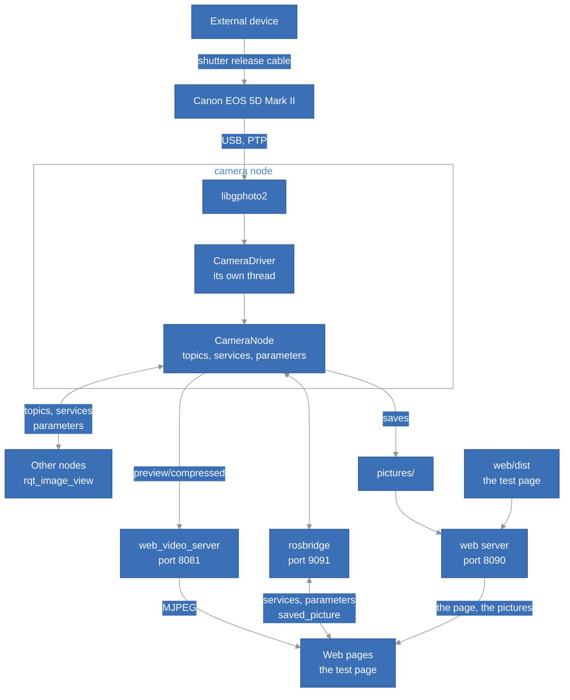
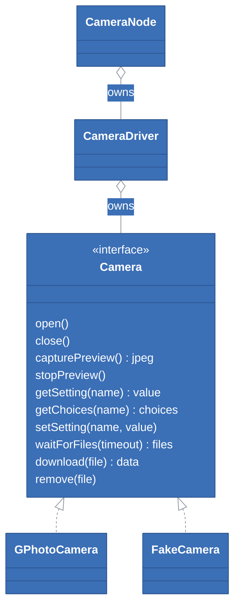
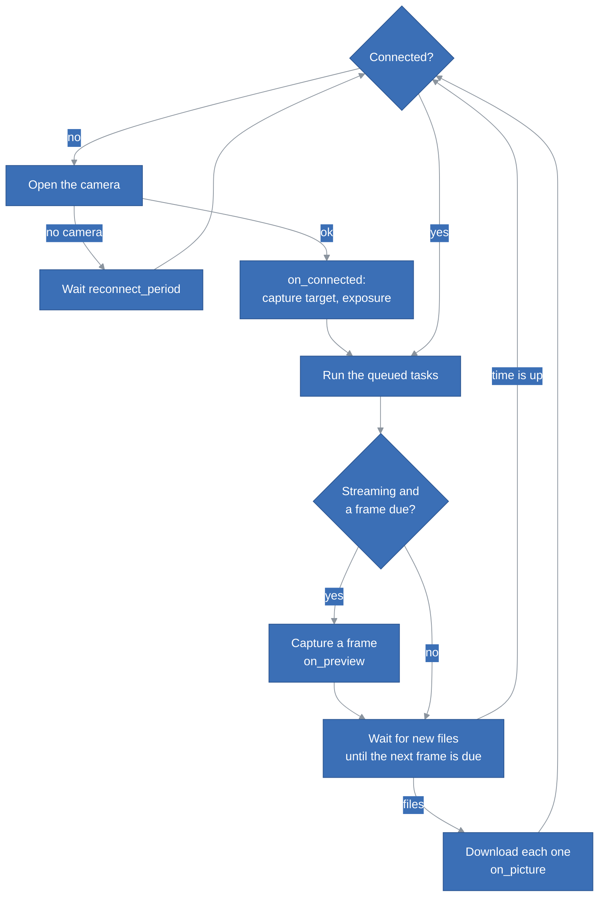
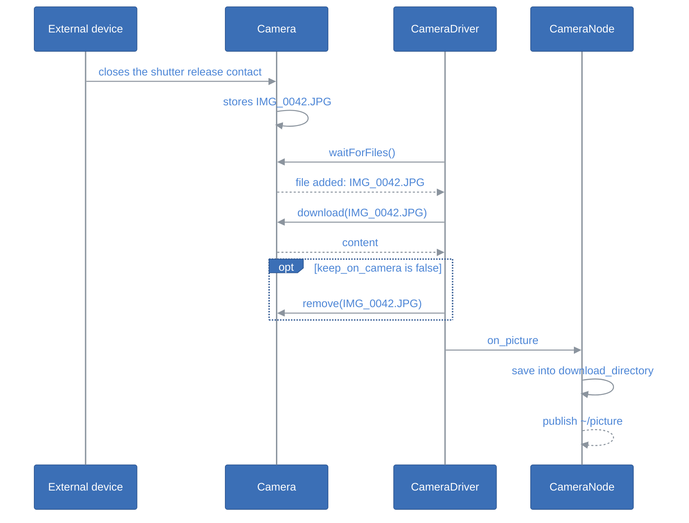

# StepIt Camera Architecture

## Table of Contents <!-- omit in toc -->

- [Introduction](#introduction)
- [The Big Picture](#the-big-picture)
- [The Packages](#the-packages)
- [The Classes](#the-classes)
  - [Camera](#camera)
  - [GPhotoCamera](#gphotocamera)
  - [FakeCamera](#fakecamera)
  - [CameraDriver](#cameradriver)
  - [CameraNode](#cameranode)
- [One Thread Owns the Camera](#one-thread-owns-the-camera)
- [Streaming](#streaming)
- [Downloading the Pictures](#downloading-the-pictures)
- [The Web Server](#the-web-server)
- [The Exposure](#the-exposure)
- [Losing the Camera](#losing-the-camera)
- [The Container](#the-container)
- [Tests](#tests)
- [How to Extend the Driver](#how-to-extend-the-driver)
- [Design Decisions and Trade-offs](#design-decisions-and-trade-offs)

## Introduction

This document explains how StepIt Camera is built, what each part is responsible for, and where to start when we want to change something. It assumes we have read the [README](../README.md) and run the driver once.

It follows one idea: **the camera is a device that answers one request at a time**. Everything the driver does, streaming, downloading and changing a setting, goes through a single thread that owns the camera, and the rest of the node only talks to that thread.

## The Big Picture

The camera is fired by an external precision device, through the remote shutter release cable. The driver does not take the pictures itself: it watches the camera over USB, downloads the pictures it takes, streams its live view and changes its settings. The one exception is a test shot, `~/take_picture`, which releases the shutter over USB to check the framing and the exposure.

The node's interface:

| Name | Type | What it does |
|---|---|---|
| `~/preview/compressed` | `sensor_msgs/CompressedImage` topic | The live view, as JPEG frames, while streaming. |
| `~/picture` | `stepit_camera_msgs/Picture` topic | Each picture the camera takes, with its content and where it was saved. |
| `~/saved_picture` | `stepit_camera_msgs/Picture` topic | Each picture once saved, without its content, for whoever can read the file: a node on the same computer, or a web page through the web server. |
| `~/start_streaming`, `~/stop_streaming` | `std_srvs/Trigger` services | Switch the live view on and off. |
| `~/get_settings` | `stepit_camera_msgs/GetSettings` service | The current exposure, and the values each setting accepts. |
| `~/take_picture` | `std_srvs/Trigger` service | A test shot: release the shutter over USB. The picture comes on `~/picture`. |
| `iso`, `shutter_speed`, `aperture`, `exposure_compensation`, `white_balance` | parameters | The settings of the camera. |

The launch file also starts, for web pages, the web server of the package, which serves the test page and the saved pictures over HTTP on port 8090 (see [The Web Server](#the-web-server)), [web_video_server](https://github.com/RobotWebTools/web_video_server), which serves the live view as MJPEG on port 8081 (`type=ros_compressed` passes the camera's JPEG frames through), and [rosbridge](https://github.com/RobotWebTools/rosbridge_suite) on port 9091. The camera needs a rosbridge of its own, rather than the one of StepIt Commander on port 9090, because a rosbridge can only handle the messages installed next to it, and `stepit_camera_msgs` is installed here only.

## The Packages

The split follows the [StepIt Commander](https://github.com/kineticsystem/stepit-commander): the code, its interfaces and its tests live in separate packages.

| Package | Role |
|---|---|
| `stepit_camera_msgs` | The message of a picture, and the service reading the settings. No code. |
| `stepit_camera` | The driver: a library holding every class, the node and web server executables, their parameters and the launch file. |
| `stepit_camera_tests` | All tests, run against the fake camera. The other packages carry none. |

The library is shared rather than static, so that its private dependencies, libgphoto2, libjpeg and cpp-httplib, do not leak into the packages that link it, i.e. the tests.

The test page, in [`web`](../web), is not a ROS package: a `COLCON_IGNORE` keeps colcon out of it, and the scripts in `bin` build and test it with pnpm. See [WEB_PAGE.md](WEB_PAGE.md).

## The Classes

### Camera

[`camera.hpp`](../src/stepit_camera/include/stepit_camera/camera.hpp) is the interface between the driver and a camera: the handful of operations the driver needs, and nothing of libgphoto2. Every failure is a `CameraError`, which tells whether it is **fatal**, i.e. the connection is gone, or not, e.g. a value the camera refuses. That one flag decides everything the driver does about errors, see [Losing the Camera](#losing-the-camera).

The settings are named as libgphoto2 names them, e.g. `shutterspeed`, which is what `gphoto2 --list-config` shows. Their values are text, exactly as the camera shows them, e.g. `1/125`.

### GPhotoCamera

[`gphoto_camera.cpp`](../src/stepit_camera/src/gphoto_camera.cpp) implements the interface with libgphoto2. It opens the first camera libgphoto2 detects, since there is only one on the robot. It is the only file that includes the libgphoto2 headers.

A few details that matter on a Canon EOS:

- **The live view** starts with the first `gp_camera_capture_preview`, and only stops when the setting `viewfinder` is switched off. `stopPreview()` does that, so that the mirror goes down again.
- **A shot during the live view** stops it, although `viewfinder` still reads on: every frame fails until `viewfinder` is switched off and on again. The driver does that, see [Losing the Camera](#losing-the-camera).
- **A test shot** is `gp_camera_trigger_capture`, which presses and releases the shutter button remotely, and works during the live view. The shutter button on the body of a 5D Mark II, on the other hand, does nothing while the live view runs over USB.
- **The events.** The camera reports a stream of events, most of them about properties that changed. `waitForFiles()` keeps reading them until a file is added or the time is up, then collects whatever else is already queued, because RAW+JPEG adds two files for one shot.
- **The fatal errors** are the errors of the USB port (`GP_ERROR_IO` and `GP_ERROR_IO_*`) and the camera no longer being found. A camera busy writing a picture to the card (`GP_ERROR_CAMERA_BUSY`) is not fatal.

### FakeCamera

[`fake_camera.cpp`](../src/stepit_camera/src/fake_camera.cpp) is a camera that exists only in memory, with the settings and the choices of a 5D Mark II on M. Its live view is a moving test pattern, encoded with libjpeg, and `trigger()` stands for the external device firing the shutter. Like a 5D Mark II, a shot during the live view breaks it until `stopPreview()`. `setConnected(false)` unplugs it, to test the reconnection.

It runs in the tests, and in the node with the parameter `fake_camera`, where the service `~/take_picture` calls `trigger()`, as it does on a real camera. Unlike a real camera, it is thread safe, so that a test can trigger it while the driver's thread waits for its pictures.

### CameraDriver

[`camera_driver.cpp`](../src/stepit_camera/src/camera_driver.cpp) runs the camera on a thread of its own, see [One Thread Owns the Camera](#one-thread-owns-the-camera). It knows nothing of ROS: it hands the frames and the pictures over through callbacks, and other threads reach the camera through `run()`.

### CameraNode

[`camera_node.cpp`](../src/stepit_camera/src/camera_node.cpp) is the ROS2 interface. It declares the parameters, creates the publishers and the services, and turns the callbacks of the driver into messages. It configures the camera every time the driver connects to it.

[`settings.cpp`](../src/stepit_camera/src/settings.cpp) holds what the node needs and can be tested alone: the table of the settings exposed as parameters, matching a value to the camera's choices, and saving a picture without overwriting another one.

## One Thread Owns the Camera

libgphoto2 is not thread safe, and a camera answers one request at a time over USB. The driver therefore gives the camera to a single thread, which runs this loop:

Any other thread that needs the camera, e.g. the node changing the ISO, queues a **task** with `CameraDriver::run()`, and waits for its result. A task is a function of the camera wrapped in a `std::packaged_task`, so its return value and its exceptions reach the caller as if it had called the camera itself. The loop runs the queued tasks at every turn, and a turn lasts at most `poll_period` (100 ms) when not streaming, or until the next frame when streaming, so a task never waits long.

`run()` called from the driver's own thread, i.e. from one of its callbacks, calls the function straight away instead of queuing it, since queuing would wait for that same thread forever.

## Streaming

`setStreaming()` only sets a flag, which the loop reads at every turn: the services `start_streaming` and `stop_streaming` return at once, and the choice survives a disconnection. When the flag is on, the loop captures a frame every `1 / preview_rate` seconds, and spends the time in between waiting for pictures. When the flag goes off, the loop switches the live view off on the camera.

The frames are published as they come out of the camera, JPEG images in a `sensor_msgs/CompressedImage`, on `~/preview/compressed`. Tools that use `image_transport`, such as `rqt_image_view`, see them as the `compressed` transport of `~/preview`.

## Downloading the Pictures

When the camera connects, the node sets its `capturetarget`:

- **Memory card**, with `keep_on_camera` true, the default. Every picture stays on the card as well: nothing is lost if the computer fails to download it.
- **Internal RAM**, with `keep_on_camera` false. The pictures only live in the camera's memory until they are downloaded, and the driver deletes them after downloading them, so the card never fills up.

The node saves a picture under its name on the camera, and never overwrites a file: the camera numbers its files from `IMG_0001` again after `IMG_9999` or with a new card, so a name can come back, and the second file gets a suffix, e.g. `IMG_0001_1.JPG`. Then it publishes the picture twice: on `~/saved_picture` without its content, and on `~/picture` with it, so that a node on another computer receives it too. A picture that could not be saved only comes on `~/picture`.

## The Web Server

`web_server` is a second executable of the package, launched next to the node, with [cpp-httplib](https://github.com/yhirose/cpp-httplib). `WebServer` serves two folders:

- `/`: the test page, `web/dist`, as `build` bundles it;
- `/pictures/<name>`: the pictures, `download_directory`, read from the same `camera.yaml` as the node.

It serves the files as they are on disk, with `Range` requests, so that the test page reads only the JPEG preview of a RAW file: its location is in the first 64 KB of the file, and the preview of a 5D Mark II is about 1.4 MB of a 30 MB file. Every response allows any origin, and exposes `Content-Range`, so that a page served elsewhere, e.g. the application of the rig, can load the pictures too.

The server is a process of its own, rather than a thread of the camera node: the node's threads stay those that own the camera and spin ROS, and the server can be left out with `web:=false`. It is a ROS node only to read its parameters from the same file and be launched the same way; it has no topic nor service.

Two details of cpp-httplib matter. It sets `SO_REUSEPORT` by default, which lets a second server take the same port and share the requests with the first one, e.g. a server left over from a failed launch: `WebServer` sets `SO_REUSEADDR` only, so that such a server fails with a clear message. And its file extensions are case sensitive, while a Canon names its files in capitals, e.g. `IMG_0001.CR2`: both spellings are mapped.

## The Exposure

The settings are five ROS parameters. The table `SETTINGS` in [`settings.hpp`](../src/stepit_camera/include/stepit_camera/settings.hpp) maps each one to its libgphoto2 setting:

| Parameter | libgphoto2 setting |
|---|---|
| `iso` | `iso` |
| `shutter_speed` | `shutterspeed` |
| `aperture` | `aperture` |
| `exposure_compensation` | `exposurecompensation` |
| `white_balance` | `whitebalance` |

A new value goes through the node's `on_set_parameters` callback. When the camera is connected, the callback runs a task that matches the value to the camera's choices, sets it, and returns. If the camera refuses it, the callback rejects the parameter, and the reason lists the choices. When the camera is not connected, the value is only remembered.

Every time the camera connects, the node applies the values it remembers, and leaves alone the settings whose value is empty. It then logs the current exposure.

The values are matched rather than compared, by `matchChoice()`:

- `ros2 param set` sends `400` as an integer and `5.6` as a double, so the parameters are dynamically typed, and a number is written back as text before being matched.
- A number matches a numeric choice with the same value, e.g. `5.60` finds `5.6`, and `-1` finds `-1`.
- Letter case is ignored, e.g. `auto` finds `Auto`.
- A fraction is only compared as text: `1/4` is not the number `0.25`.

The callback cannot read the ROS parameters from the driver's thread, since `set_parameters` holds the parameters' lock while it waits for that thread. The node therefore keeps its own copy of the values, `wanted_settings_`, behind a lock of its own, and `onConnected` reads that copy instead.

## Losing the Camera

The camera goes away all the time in practice: it is switched off, it goes to sleep, the cable is pulled. The driver handles it in one place, the loop:

- A **fatal** error closes the camera, drops the queued tasks, so that their callers get a `CameraError` instead of waiting, and reports `on_disconnected`. The loop then tries to open the camera again every `reconnect_period`, and configures it again when it comes back.
- A **non-fatal** error is reported as a warning, and the loop carries on.
- A **frame** that fails is not fatal on its own, because the camera is busy for a moment after each shot, while it writes the picture. Only `max_preview_failures` (5) failures in a row count as a lost connection. After a failed frame, the driver switches the live view off, so that the next frame starts it again: a Canon EOS does not start it again by itself after a shot.

Streaming survives a disconnection: the flag stays on, and the live view starts again on its own when the camera comes back.

When the node stops, the driver switches the live view off before closing the camera, so that the camera is left ready to shoot through the viewfinder.

## The Container

The container copies those of the other StepIt projects: the same Dockerfile structure, the same `dock.sh`, the same scripts in `bin`, and the same DDS configuration, so that the camera node and the robot see each other's topics. What is specific to the camera:

- The container is **privileged and mounts `/dev`**, like the robot's own container for its serial port. libgphoto2 opens the camera through `/dev/bus/usb`, and a camera that is unplugged and plugged in again comes back under a new device number, which a single mounted device would miss.
- The image installs `libgphoto2-dev` and `libjpeg-dev`, and the `gphoto2` command line tool, to check the camera by hand.
- The image installs `libcpp-httplib-dev` for the web server, and Node.js with pnpm to build the test page. The container shares the host's network, so the page's development server uses port 5174 rather than Vite's 5173, which the StepIt Editor takes.
- The pictures go to `~/ws/pictures` in the container, which is the folder [`pictures`](../pictures) of the repo on the host. The folder is in the repo, with its content ignored by git, so that Docker never creates it as root.

## Tests

The tests run against the fake camera, so they need no hardware:

| Test | What it covers |
|---|---|
| `test_settings` | Matching values to choices, the capture target, expanding `~`, saving pictures without overwriting. |
| `test_fake_camera` | The fake camera behaves as the driver expects a camera to: live view, settings, events, unplugging. |
| `test_camera_driver` | The loop: streaming on request and at the requested rate, downloading while streaming, deleting after download, tasks and their errors, reconnecting, stopping cleanly. |
| `test_camera_node` | The ROS2 interface end to end: the services, the topics, the saved files and the parameters. |
| `test_web_server` | The page and the pictures over HTTP: ranges, content types, the origin headers, nothing served outside the two folders, a port already in use. |

The test page has tests of its own, with vitest: see [WEB_PAGE.md](WEB_PAGE.md#tests).

`GPhotoCamera` has no test of its own: it needs a real camera. Check it by hand, with the camera plugged in, following the README.

## How to Extend the Driver

**A new setting**, e.g. the white balance, is one line in `SETTINGS`, with the name of its parameter and its libgphoto2 name, as `gphoto2 --list-config` shows it. The node declares the parameter, applies it and lists it in `get_settings` with no other change. Add its choices to the fake camera, and a test.

**Another camera** that libgphoto2 supports needs no code, as long as it has the same setting names. Canon EOS cameras share them; other brands may not, e.g. `f-number` instead of `aperture`.

**Another way to reach a camera**, e.g. Canon's own SDK, is another implementation of `Camera`. The driver and the node do not change.

## Design Decisions and Trade-offs

**libgphoto2, not Canon's SDK.** Canon's EDSDK runs on Ubuntu, but does not support the 5D Mark II, and it is proprietary. libgphoto2 supports the 5D Mark II with capture, live view and configuration. It is LGPL, which an MIT project can link dynamically. See the research in [canon_driver.md](canon_driver.md).

**One node, not `gphoto2` piped into a virtual webcam.** Piping `gphoto2 --capture-movie` into `v4l2loopback` gives a live view with no code, but that process holds the camera, so nothing else can change a setting or download a picture meanwhile.

**The frames are not decoded.** The camera already sends JPEG images, so publishing them as they come costs nothing. A node that needs raw pixels can subscribe through `image_transport`, which decodes them.

**The driver does not trigger the camera.** The external device fires it with a precision that a USB command cannot match. The driver only watches for the pictures, which is also why the stamp of a picture is the time of its download, not of the shot. A test shot is the one exception: it only checks the framing and the exposure, so its timing does not matter, and its picture comes the same way as the others.

**Parameters for the exposure, services for the live view.** A setting is a state, which `ros2 param`, `rqt_reconfigure` and launch files already know how to set, save and restore. Starting the live view is an action, which a service expresses better, and it returns at once.

**Pictures are published with their content, and without it.** A 5D Mark II RAW file is about 30 MB, which is heavy for DDS over a network. The content on `~/picture` makes the picture available to any node, even on another computer. `~/saved_picture` carries the same message without it, for a node on the same computer, which reads `path`, and for web pages: rosbridge would send the content as base64 in JSON, about 40 MB of text, through the WebSocket that also carries the services, and decoded by JavaScript. Two topics rather than a parameter, so that both kinds of subscriber can be served at once.

**HTTP for the pictures, in a server of the package.** A browser loads a file over HTTP in binary, in the background, with ranges, and gives it a URL it can link to. web_video_server only serves topics, and rosbridge only speaks JSON, so the package has its own server. It also serves the test page, so that the page and the pictures share an origin, and Node.js is needed only to build the page, not to run it.
