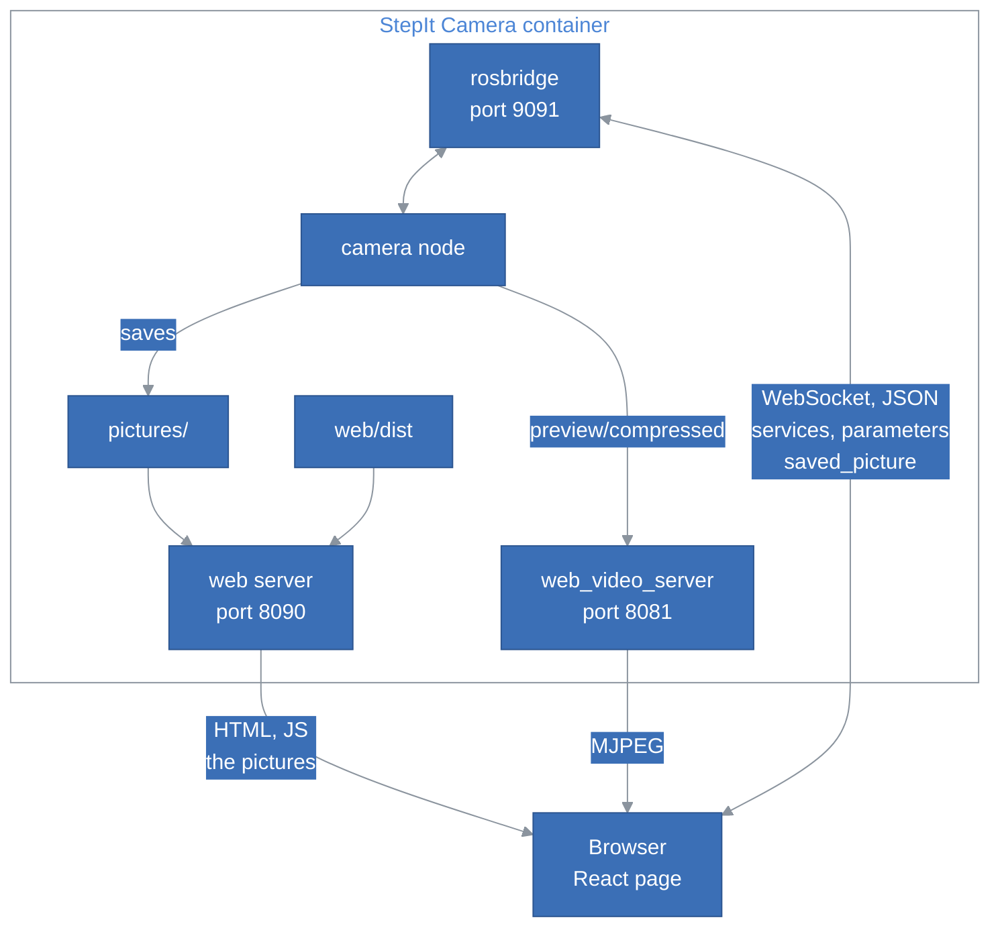
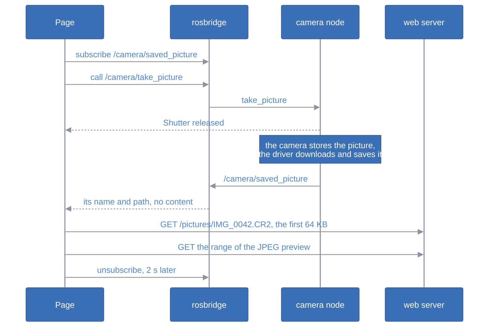

# The Test Page

## Table of Contents <!-- omit in toc -->

- [Introduction](#introduction)
- [The Big Picture](#the-big-picture)
- [The Layers](#the-layers)
- [Talking to the Driver](#talking-to-the-driver)
  - [The rosbridge Client](#the-rosbridge-client)
  - [One rosbridge per Module](#one-rosbridge-per-module)
- [The Camera Section](#the-camera-section)
  - [The Live View](#the-live-view)
  - [The Settings](#the-settings)
  - [The Test Shot](#the-test-shot)
- [Tests](#tests)
- [Design Decisions and Trade-offs](#design-decisions-and-trade-offs)

## Introduction

This document explains how the test page of StepIt Camera, in [`web`](../web), is built, and where to start when we want to change something. It assumes we have read [The Test Page](../README.md#the-test-page) in the README and used the page once.

The page tries the camera and the driver from a browser. The code that talks to the driver, `ros/` and `camera/`, does not depend on the page, and can be reused by another web application.

## The Big Picture

The page is a single-page React application, built into `web/dist` and served as static files by the driver's web server. It has no API of its own: the browser talks to the driver's servers directly.

## The Layers

The client is in `src/client`, in three layers, each depending only on those below it:

| Layer | Files | Knows about |
|---|---|---|
| Transport | `ros/rosbridge.ts`, `ros/connection.ts` | rosbridge's protocol. Nothing about the camera. |
| Camera | `camera/camera.ts`, `camera/format.ts`, `camera/picture.ts`, `camera/raw.ts` | The camera's ROS interface, and its pictures on the web server. No React. |
| State and views | `camera/store.ts`, `components/`, `App.tsx` | What the user sees and does. |

`settings.ts` keeps the preferences of the browser in `localStorage`: the theme, and where the camera's rosbridge and web_video_server are. The state lives in [zustand](https://github.com/pmndrs/zustand) stores.

## Talking to the Driver

### The rosbridge Client

`Rosbridge` in [`rosbridge.ts`](../web/src/client/ros/rosbridge.ts) is a small client of the rosbridge protocol, written for the page rather than taken from `roslibjs`:

- `callService()` sends `call_service` and resolves with the `service_response`. It fails at once when not connected, rather than waiting, so that a button can say it did not work; and it fails after a timeout, or when the connection drops.
- `subscribe()` sends one `subscribe` per topic, whatever the number of listeners, and `unsubscribe` with the last one. The subscriptions survive a reconnection.
- The connection comes back on its own, every 2 seconds, e.g. while the driver restarts.
- A message larger than rosbridge's fragment size, 10 MB, comes as `fragment` messages, which the client puts back together. The page no longer receives such messages, since the pictures come over HTTP, but the client still handles them.
- A `uint8[]` field comes as base64 text: `decodeBytes()` turns it back into bytes.

### One rosbridge per Module

A rosbridge can only handle the messages installed next to it, so the camera serves its own, which knows `stepit_camera_msgs`, on port 9091 rather than the default 9090, where another rosbridge may run. [`connection.ts`](../web/src/client/ros/connection.ts) keeps one connection per URL, shared by whoever uses it, with its status, which the top of the page shows: the page has a single section, the camera, but a page talking to several ROS2 systems, each with its own rosbridge, would open one connection per system.

## The Camera Section

`Camera` in [`camera.ts`](../web/src/client/camera/camera.ts) is the camera driver's interface, one method per service. [`store.ts`](../web/src/client/camera/store.ts) holds the section's state, and `followCamera()` keeps it up to date while the section is open.

### The Live View

The live view is a plain `` whose source is web_video_server's MJPEG stream, with `type=ros_compressed`: the camera's JPEG frames go to the browser as they are, never decoded. The topic is written unescaped in the URL, since web_video_server does not decode `%2F`.

The driver only sends frames while streaming is on. During a test shot, no frame comes: the mirror goes down for the shot, and the driver is busy downloading the picture. The `` keeps the last frame, which the page greys out from the click until the picture has come. The page only knows about its own test shots: a shot fired by an external device pauses the live view too, without greying it out. The live view is off when the page opens, so that opening the page does not raise the mirror: the Start and Stop buttons call `start_streaming` and `stop_streaming`. Once started, the page calls `start_streaming` again whenever rosbridge reconnects, e.g. after the driver restarted, since a new driver starts with the live view off.

### The Settings

`get_settings` returns each setting with its value and the values the camera accepts right now. The page reads them when it connects, after each change, and every 3 seconds, to follow the mode dial and changes made on the camera itself. A change is a `set_parameters` call, as `ros2 param set` does; when the camera refuses it, the reason, which lists the accepted values, is shown under the setting.

[`format.ts`](../web/src/client/camera/format.ts) orders and labels the settings, and writes their values as the camera does, e.g. `f/5.6` and `1/125 s`. A setting it does not know is still shown, by its name: a setting added to the driver needs no change here.

### The Test Shot

The page subscribes to `/camera/saved_picture` only while it waits for its shot, since it only shows its own shots. It subscribes before releasing the shutter, so that the picture cannot come first, and keeps listening 2 seconds after the first file, for the second file of a RAW+JPEG shot.

The message carries the path of the file, not its content: [`picture.ts`](../web/src/client/camera/picture.ts) loads it from the web server, at `/pictures/<file name>`, the path's last part, since the driver may have added a suffix to the camera's name. The page is served by the same server, so the address is relative; the development server passes `/pictures` on to port 8090.

A JPEG is shown from the server as it is. A browser cannot show a RAW file, but a Canon CR2 carries a full-size JPEG preview: [`raw.ts`](../web/src/client/camera/raw.ts) finds it in the TIFF structure of the file, as the first image's only strip, whose location is in the first 64 KB. `picture.ts` reads those with a `Range` request, then the preview with another, about 1.4 MB of a 30 MB file, and shows it through an object URL. The size of the whole file comes from `Content-Range`. The name of the file links to it, to download it whole.

## Tests

The tests, in [`tests`](../web/tests), run with vitest in Node.js, without a browser or a camera:

- [`fakeSocket.ts`](../web/tests/fakeSocket.ts) stands in for the WebSocket, records what the page sends, and answers as rosbridge would.
- `rosbridge.test.ts` covers the protocol: calls, errors, timeouts, subscriptions, fragments and reconnections.
- `camera.test.ts` covers the camera's requests and responses, the address of a picture, and the formatting of the settings.
- `raw.test.ts` covers the preview of a RAW file, on a TIFF built by [`tiff.ts`](../web/tests/tiff.ts). With `RAW_SAMPLE=<file.CR2>`, it also checks a real file.
- `picture.test.ts` covers loading a picture, against a fake `fetch`: the ranges asked for, a server without ranges, and a missing file.

The components are thin and have no tests: check them in a browser, against the fake camera (`fake:=true`).

## Design Decisions and Trade-offs

**No API.** The browser reaches the driver's servers directly: the web server for the page and the pictures, rosbridge for the rest, and web_video_server for the live view. The price is that the browser must reach three ports, 8090, 8081 and 9091.

**web_video_server for the live view.** The live view is 10 frames per second: through rosbridge, each would be a base64 JSON message, decoded by JavaScript. web_video_server streams the JPEG frames as they are, and the browser shows MJPEG natively.

**The pictures come over HTTP, not through rosbridge.** Through rosbridge, a 30 MB RAW file would be 40 MB of base64 text in JSON, in fragments, ahead of every service call on the same WebSocket, and decoded by JavaScript on the page's thread. Over HTTP, the browser loads it in binary, in the background, and only the part the page shows: see [The Test Shot](#the-test-shot).

**Our own rosbridge client.** The page needs little of rosbridge: a few calls and subscriptions. `roslibjs` would bring more than we use, and callbacks rather than promises.
